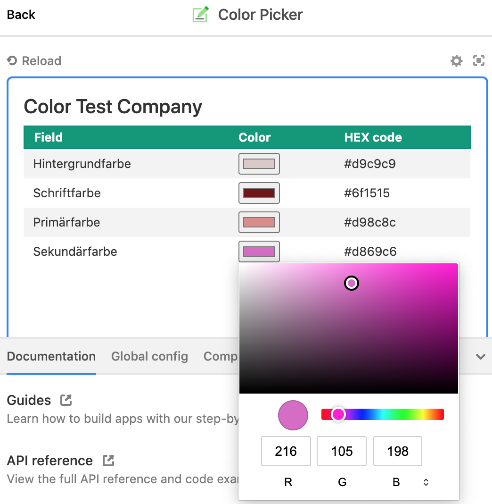

> 🎨 Simple color picker app for your Airtable tables.

# airtable-color-picker

## Installation

Read Airtable's guide on [how to remix from Github](https://airtable.com/developers/apps/guides/remix-from-github).

## Contribute 🦸

Contributions are more than welcome! I love how Airtable helps us building great admin UIs for our web and mobile apps in a short time. That's why I'd like to give back with contributions like this. If you feel the same and would like to join me in this project it would be awesome to get in touch! 😊

Please feel free to create, comment and of course solve some of the issues. To get started you can also go for the easier issues marked with the `good first issue` label if you like.

### Development

#### Initial setup

1. Run `npx block set-api-key` and enter the API key as seen in the Airtable account.
1. Run `npx block add-remote <blockIdentifier> color_picker`, where the `<blockIdentifier>` can be found in the Airtable UI when creating a new app or when editing an app and clicking on "How do I run apps locally?".

#### Run the app

1. Run `npm start`.
1. Paste the local URL copied to the clipboard to the Aritable edit app UI.

## License

The [MIT License](LICENSE)

## Credits

The _airtable-color-picker_ library is maintained and sponsored by the Swiss web and mobile app development company [Florian Gyger Software](https://floriangyger.ch).

If this library saved you some time and money please consider [sponsoring me](https://github.com/sponsors/flogy), so I can build more libraries for free and actively maintain them for you. Thank you 🙏
